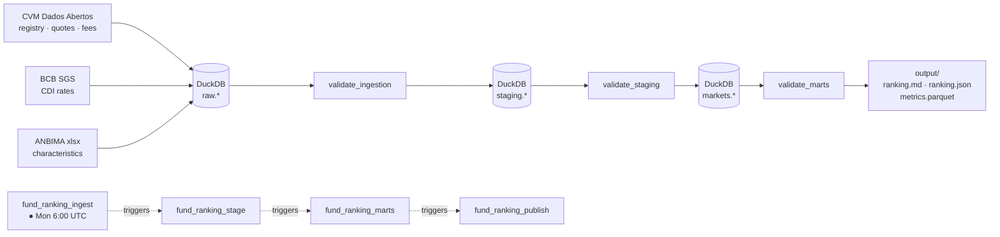

# Fixed Income Fund Ranking

End-to-end pipeline that sources, scores, and ranks Brazilian CVM-registered
fixed-income funds (RCVM 175) against a configurable reference date. Runs on a
weekly Airflow schedule and writes human-readable and machine-readable outputs.

[Video walkthrough](https://www.youtube.com/watch?v=Rynx-ReAG5g)

## Architecture



Data flows through three DuckDB layers. Each layer boundary has a validation gate
that writes results to `logs.validation_log` and fails the DAG on error-severity
findings before the next layer starts.

## Airflow DAGs

Four chained DAGs run sequentially (DuckDB allows one writer at a time). Each triggers the next on success.

| DAG | Schedule | Tasks |
|-----|----------|-------|
| `fund_ranking_ingest` | Mon 6:00 UTC | `registro` → `inf_diario` → `cad_fi_hist` → `extrato` → `cdi` → `anbima` → `cleanup` → `validate_ingestion` |
| `fund_ranking_stage` | triggered | `registry` → `fees` → `daily_quotes` → `cdi_rates` → `anbima` → `validate_staging` |
| `fund_ranking_marts` | triggered | `universe` → `metrics` → `rankings` → `validate_marts` |
| `fund_ranking_publish` | triggered | `report` → `publish` |

All tasks are idempotent. Ingest tasks skip sources already loaded today unless `force=True`. Mart tasks delete and rewrite the snapshot for the given `reference_date`. The marts DAG accepts a `reference_date` param (ISO string); defaults to today.

## Validation gates

Each layer boundary has a validation step that writes results to `logs.validation_log` and halts the DAG on error-severity failures.

| Gate | Layer | What is checked |
|------|-------|-----------------|
| `validate_ingestion` | raw | Row counts and freshness for all 8 raw tables; null rates on NAV, AuM, shareholders; no negative CDI; known categorical values; CNPJ format; ANBIMA required columns present |
| `validate_staging` | staging | PK uniqueness and null `fund_cnpj` for all 5 staging tables; trailing-window coverage for quotes and CDI; NAV/AuM/shareholders outliers; no gaps > 10 days in CDI; no negative fees |
| `validate_marts` | marts | Universe size ≥ 50 funds; metric bounds (no negative vol, drawdown ≤ 0, Sharpe ≤ 100, return in range); `ir_rate` and `investor_level` validity; score in [0, 1]; all configured ranking combos present |

## Setup

### Prerequisites

- Python 3.13+
- [Poetry](https://python-poetry.org/docs/#installation)
- Docker (for Airflow)

### ANBIMA data (one-time manual download)

The pipeline uses one public ANBIMA file that must be placed in `data/raw/anbima/`:

| File | Source |
|------|--------|
| `FUNDOS-175-CARACTERISTICAS-PUBLICO.xlsx` | [data.anbima.com.br](https://data.anbima.com.br/datasets/fundos-175-caracteristicas-publico/detalhes) → Datasets → Fundos 175 Características → Download |

This file is not auto-fetched because the ANBIMA public portal requires a browser
session. The pipeline reads it on every run and raises an error if it is more than
15 days old.

### Airflow

```bash
poetry install
docker compose -f airflow/docker-compose-airflow.yml up
```

Set the `duckdb_path` Airflow Variable to the absolute path of the DuckDB file
(e.g. `/pipeline/data/fund_ranking.duckdb`). Optionally set `config_yaml_path`
to point to a non-default `config.yaml`.

Enable `fund_ranking_ingest` in the Airflow UI — the remaining three DAGs are
triggered automatically on each successful run.

### Streamlit dashboard

A read-only Streamlit app browses the published rankings, per-fund detail, and
validation log directly from the DuckDB file produced by the pipeline.

```bash
poetry install
poetry run streamlit run dashboard/app.py
```

Opens at <http://localhost:8501>. The app reads `data/fund_ranking.duckdb`; run
the pipeline at least once before launching it.

| Page | What it shows |
|------|---------------|
| Rankings | Top-N table per purpose × profile × investor type, with reference-date selector |
| Fund detail | Header card, trailing returns, risk metrics, and AuM history for a single fund |
| Validation | Latest `logs.validation_log` entries grouped by gate and severity |

## Outputs

| File | Description |
|------|-------------|
| `output/ranking.md` | Top-N funds per segment + methodology (human-readable) |
| `output/ranking.json` | Same ranking, machine-readable — fixed data contract |
| `output/metrics.parquet` | Full metrics for all eligible funds (40+ columns) |
| `logs/pipeline.log` | Appended log of every run |

## Configuration

All tunable parameters live in [`config.yaml`](config.yaml):

| Key | Description |
|-----|-------------|
| `reference_date` | Ranking reference date — `null` defaults to today |
| `history_start` | Earliest date to fetch from CVM (default `2021-01-01`) |
| `universe.*` | AuM, holder count, span, freshness, and sparseness thresholds |
| `windows` | Trailing return windows (months) |
| `tax` | IR rates by taxation regime and exempt-fund keyword list |
| `scoring` | Feature weights per purpose × profile |
| `rankings` | List of purpose × profile × investor-type combos to produce |
| `top_n` | Number of funds to show per segment (default 5) |

## Project layout

```
run.py                         # single-command pipeline entry point (non-Airflow)
config.yaml                    # all tunable parameters
src/
├── config.py                  # Settings dataclass, path constants
├── storage.py                 # DuckDBWarehouse (upsert, snapshot, temp_view)
├── schemas.py                 # DDL for all DuckDB tables
├── ingestion/
│   ├── cvm.py                 # CVM Dados Abertos bulk download + parse
│   ├── bcb.py                 # BCB SGS CDI series
│   ├── anbima_xlsx.py         # ANBIMA public xlsx parse
│   ├── ingest.py              # orchestrates all ingestion sources
│   └── _utils.py              # shared HTTP helpers
├── staging/
│   ├── registry.py            # fund registry → staging.registry
│   ├── daily_quotes.py        # inf_diario → staging.daily_quotes
│   ├── fees.py                # cad_fi_hist → staging.fees
│   ├── cdi_rates.py           # BCB CDI → staging.cdi_rates
│   ├── anbima.py              # ANBIMA xlsx → staging.anbima
│   └── stage.py               # orchestrates all staging transforms
├── marts/
│   ├── universe.py            # eligible fund universe
│   ├── metrics.py             # return, risk, and tax-layer metrics
│   ├── ranking.py             # percentile scoring and ranking
│   ├── mart.py                # orchestrates universe → metrics → rankings
│   └── compute/
│       ├── returns.py         # trailing returns, monthly compounding, CAGR
│       ├── risk.py            # volatility, Sharpe, max drawdown
│       └── tax.py             # IR net-return helpers
├── publish/
│   ├── report.py              # markdown report generation
│   └── publish.py             # ranking.json and metrics.parquet writers
└── validation/
    ├── validate_ingestion.py  # raw-layer checks (post-ingest gate)
    ├── validate_staging.py    # staging-layer checks (post-stage gate)
    └── validate_marts.py      # marts-layer checks (post-compute gate)
airflow/
├── dags/
│   ├── ingest_dag.py
│   ├── staging_dag.py
│   ├── marts_dag.py
│   └── publish_dag.py
└── docker-compose-airflow.yml
dashboard/
├── app.py                     # Streamlit entry point + navigation
├── data.py                    # cached DuckDB query helpers
└── pages/
    ├── 1_Rankings.py
    ├── 2_Fund.py
    └── 3_Validation.py
data/
├── raw/                       # cached downloads (gitignored)
└── processed/                 # parsed Parquet caches (gitignored)
output/
├── ranking.md
├── ranking.json
└── metrics.parquet
tests/
├── test_compute.py            # unit tests: returns, risk, metrics compute layer
├── test_storage.py            # DuckDBWarehouse write-pattern tests
└── test_validation.py         # validation check tests
```
