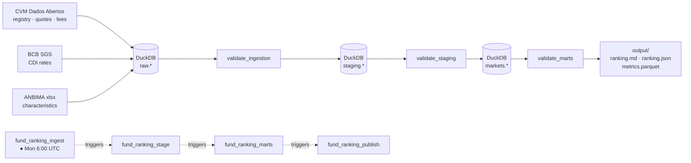

# Fixed Income Fund Ranking

End-to-end pipeline that sources, scores, and ranks Brazilian CVM-registered
fixed-income funds (RCVM 175) against a configurable reference date. Runs on a
weekly Airflow schedule and writes human-readable and machine-readable outputs.

[Video walkthrough](https://www.youtube.com/watch?v=Rynx-ReAG5g)

## Architecture



Data flows through three DuckDB layers. Each layer boundary has a validation gate
that writes results to `logs.validation_log` and fails the DAG on error-severity
findings before the next layer starts.

## Airflow DAGs

The pipeline runs as four chained Airflow DAGs. Each DAG opens its own DuckDB
connection (DuckDB allows one writer at a time, so tasks within a DAG are sequential).

### `fund_ranking_ingest` — weekly, Mon 6:00 UTC

Downloads all raw sources into `raw.*` tables, then validates and triggers staging.

| Task | What it does |
|------|--------------|
| `registro` | CVM fund/class registry snapshot → `raw.registro_classe`, `raw.registro_subclasse` |
| `inf_diario` | CVM daily NAV/AuM/shareholders files back to `history_start` → `raw.inf_diario` |
| `cad_fi_hist` | CVM historical admin and performance fee tables → `raw.cad_fi_hist_taxa_adm/perfm` |
| `extrato` | CVM current-year extrato (fee fallback) → `raw.extrato_fi` |
| `cdi` | BCB SGS daily CDI series → `raw.cdi_daily` |
| `anbima` | ANBIMA characteristics xlsx → `raw.anbima_caracteristicas` |
| `cleanup` | Deletes downloaded files from `data/raw/cvm/` after all sources are in DuckDB |
| `validate_ingestion` | Row counts, freshness, null rates, known-value checks on all `raw.*` tables |
| `trigger_staging` | Triggers `fund_ranking_stage` |

All ingest tasks are idempotent: same-day re-runs skip sources already loaded today
unless `force=True` is passed as a DAG param.

### `fund_ranking_stage` — triggered by ingest

Cleans and normalises each raw source into typed `staging.*` tables.

| Task | What it does |
|------|--------------|
| `registry` | Joins class + subclass, coerces types, formats CNPJ → `staging.registry` |
| `fees` | Merges `cad_fi_hist` (primary) + `extrato` (fallback), converts bps → % → `staging.fees` |
| `daily_quotes` | Deduplicates, renames columns, processes month-by-month → `staging.daily_quotes` |
| `cdi_rates` | Normalises BCB CDI series → `staging.cdi_rates` |
| `anbima` | Renames columns, maps investor type and taxation fields → `staging.anbima` |
| `validate_staging` | PK uniqueness, null rates, window coverage, outlier checks on all `staging.*` tables |
| `trigger_marts` | Triggers `fund_ranking_marts` |

Staging tasks skip if their target table already reflects the latest raw snapshot.

### `fund_ranking_marts` — triggered by staging

Computes the eligible universe, metrics, and rankings for the reference date.

| Task | What it does |
|------|--------------|
| `universe` | Applies eligibility filters (status, category, AuM, holders, span, freshness) → `marts.universe` |
| `metrics` | Trailing returns, alpha vs CDI, Sharpe, drawdown, volatility, CAGR, IR net layer → `marts.metrics` |
| `rankings` | Percentile scores, purpose × profile weight vectors, investor-type access filter → `marts.rankings` |
| `validate_marts` | Universe size, metric bounds, IR rate range, score validity, combo coverage checks |
| `trigger_publish` | Triggers `fund_ranking_publish` with the resolved `reference_date` |

Accepts a `reference_date` param (ISO date string); defaults to today. Each task is
idempotent via `upsert_derived`: the existing snapshot for the date is deleted and
rewritten.

### `fund_ranking_publish` — triggered by marts

Writes output files from the `marts.*` tables.

| Task | What it does |
|------|--------------|
| `report` | Renders `output/ranking.md` — methodology section + top-N tables per segment |
| `publish` | Writes `output/ranking.json` (typed data contract) and `output/metrics.parquet` |

## Validation gates

Every layer boundary has a validation step. Results are always written to
`logs.validation_log`; error-severity failures raise an exception and halt the DAG.

### validate_ingestion (raw layer)

| Table | Checks |
|-------|--------|
| `raw.inf_diario` | Row count, date freshness, NAV/AuM/shareholders null rates |
| `raw.cdi_daily` | Row count, date freshness, no negative rates, rate in daily-decimal range |
| `raw.registro_classe` | Snapshot exists, row count, CNPJ format, known `Situacao`/`Exclusivo`/`Forma_Condominio` values, Renda Fixa coverage ≥ 1000, inception date null rate |
| `raw.registro_subclasse` | Snapshot exists, row count, referential integrity vs classe ≥ 95%, known `Previdenciario` values |
| `raw.cad_fi_hist_taxa_adm` | Snapshot exists, row count, no ambiguous fee values (5–20 range) |
| `raw.cad_fi_hist_taxa_perfm` | Snapshot exists, row count |
| `raw.extrato_fi` | Snapshot exists, row count, known `EXISTE_TAXA_PERFM` values |
| `raw.anbima_caracteristicas` | Snapshot exists, row count, required columns present, known `Estrutura`/`Tributacao_Alvo` values |

### validate_staging (staging layer)

| Table | Checks |
|-------|--------|
| `staging.registry` | Snapshot exists, row count, freshness ≤ 14 days, no null `fund_cnpj`, PK unique, inception date null rate |
| `staging.daily_quotes` | Row count, date freshness, no null `fund_cnpj`, PK unique, window coverage, NAV/AuM/shareholders null rates and outliers |
| `staging.fees` | Snapshot exists, row count, freshness ≤ 14 days, no null `fund_cnpj`, PK unique, no negative `adm_fee` |
| `staging.cdi_rates` | Row count, date freshness, window coverage, no negative rates, no gaps > 10 days |
| `staging.anbima` | Snapshot exists, row count, freshness ≤ 14 days, no null `fund_cnpj`, PK unique, `redemption_days` null rate |

### validate_marts (marts layer)

| Table | Checks |
|-------|--------|
| `marts.universe` | Snapshot exists, row count, no null `fund_cnpj`, PK unique, ANBIMA enrichment null rates (`target_taxation`, `redemption_days`, `min_investment`) |
| `marts.metrics` | Snapshot exists, row count ≥ 50 distinct funds, no null `fund_cnpj`, PK unique, `ir_rate` in [0, 1], `investor_level` in {0, 1, 2}, no negative volatility, max drawdown ≤ 0, `pct_months_above_cdi` in [0, 1], 12m return bounds, |alpha_12m| ≤ 30pp, volatility ≤ 500%, |Sharpe| ≤ 100 |
| `marts.rankings` | Snapshot exists, row count, PK unique, score in [0, 1], all configured purpose × profile × investor_type combos present |

## Setup

### Prerequisites

- Python 3.13+
- [Poetry](https://python-poetry.org/docs/#installation)
- Docker (for Airflow)

### ANBIMA data (one-time manual download)

The pipeline uses one public ANBIMA file that must be placed in `data/raw/anbima/`:

| File | Source |
|------|--------|
| `FUNDOS-175-CARACTERISTICAS-PUBLICO.xlsx` | [data.anbima.com.br](https://data.anbima.com.br/datasets/fundos-175-caracteristicas-publico/detalhes) → Datasets → Fundos 175 Características → Download |

This file is not auto-fetched because the ANBIMA public portal requires a browser
session. The pipeline reads it on every run and raises an error if it is more than
15 days old.

### Airflow

```bash
poetry install
cd airflow
docker compose -f docker-compose-airflow.yml up
```

Set the `duckdb_path` Airflow Variable to the absolute path of the DuckDB file
(e.g. `/pipeline/data/fund_ranking.duckdb`). Optionally set `config_yaml_path`
to point to a non-default `config.yaml`.

Enable `fund_ranking_ingest` in the Airflow UI — the remaining three DAGs are
triggered automatically on each successful run.

## Outputs

| File | Description |
|------|-------------|
| `output/ranking.md` | Top-N funds per segment + methodology (human-readable) |
| `output/ranking.json` | Same ranking, machine-readable — fixed data contract |
| `output/metrics.parquet` | Full metrics for all eligible funds (40+ columns) |
| `logs/pipeline.log` | Appended log of every run |

## Configuration

All tunable parameters live in [`config.yaml`](config.yaml):

| Key | Description |
|-----|-------------|
| `reference_date` | Ranking reference date — `null` defaults to today |
| `history_start` | Earliest date to fetch from CVM (default `2021-01-01`) |
| `universe.*` | AuM, holder count, span, freshness, and sparseness thresholds |
| `windows` | Trailing return windows (months) |
| `tax` | IR rates by taxation regime and exempt-fund keyword list |
| `scoring` | Feature weights per purpose × profile |
| `rankings` | List of purpose × profile × investor-type combos to produce |
| `top_n` | Number of funds to show per segment (default 5) |

## Project layout

```
run.py                         # single-command pipeline entry point (non-Airflow)
config.yaml                    # all tunable parameters
src/
├── config.py                  # Settings dataclass, path constants
├── storage.py                 # DuckDBWarehouse (upsert, snapshot, temp_view)
├── schemas.py                 # DDL for all DuckDB tables
├── ingestion/
│   ├── cvm.py                 # CVM Dados Abertos bulk download + parse
│   ├── bcb.py                 # BCB SGS CDI series
│   ├── anbima_xlsx.py         # ANBIMA public xlsx parse
│   ├── ingest.py              # orchestrates all ingestion sources
│   └── _utils.py              # shared HTTP helpers
├── staging/
│   ├── registry.py            # fund registry → staging.registry
│   ├── daily_quotes.py        # inf_diario → staging.daily_quotes
│   ├── fees.py                # cad_fi_hist → staging.fees
│   ├── cdi_rates.py           # BCB CDI → staging.cdi_rates
│   ├── anbima.py              # ANBIMA xlsx → staging.anbima
│   └── stage.py               # orchestrates all staging transforms
├── marts/
│   ├── universe.py            # eligible fund universe
│   ├── metrics.py             # return, risk, and tax-layer metrics
│   ├── ranking.py             # percentile scoring and ranking
│   ├── mart.py                # orchestrates universe → metrics → rankings
│   └── compute/
│       ├── returns.py         # trailing returns, monthly compounding, CAGR
│       ├── risk.py            # volatility, Sharpe, max drawdown
│       └── tax.py             # IR net-return helpers
├── publish/
│   ├── report.py              # markdown report generation
│   └── publish.py             # ranking.json and metrics.parquet writers
└── validation/
    ├── validate_ingestion.py  # raw-layer checks (post-ingest gate)
    ├── validate_staging.py    # staging-layer checks (post-stage gate)
    └── validate_marts.py      # marts-layer checks (post-compute gate)
airflow/
├── dags/
│   ├── ingest_dag.py
│   ├── staging_dag.py
│   ├── marts_dag.py
│   └── publish_dag.py
└── docker-compose-airflow.yml
data/
├── raw/                       # cached downloads (gitignored)
└── processed/                 # parsed Parquet caches (gitignored)
output/
├── ranking.md
├── ranking.json
└── metrics.parquet
tests/
├── test_compute.py            # unit tests: returns, risk, metrics compute layer
├── test_storage.py            # DuckDBWarehouse write-pattern tests
└── test_validation.py         # validation check tests
```
